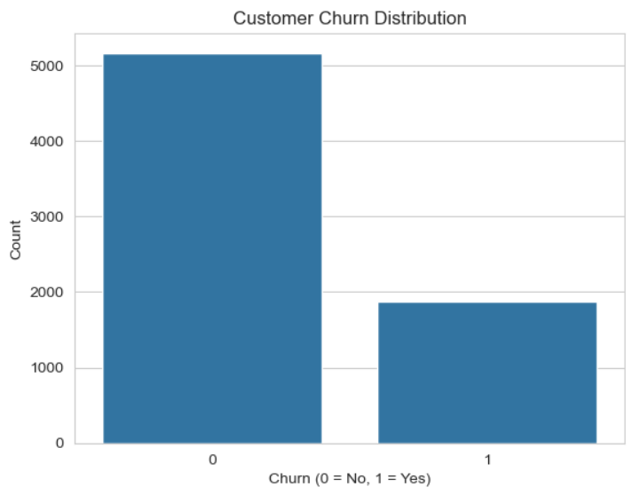
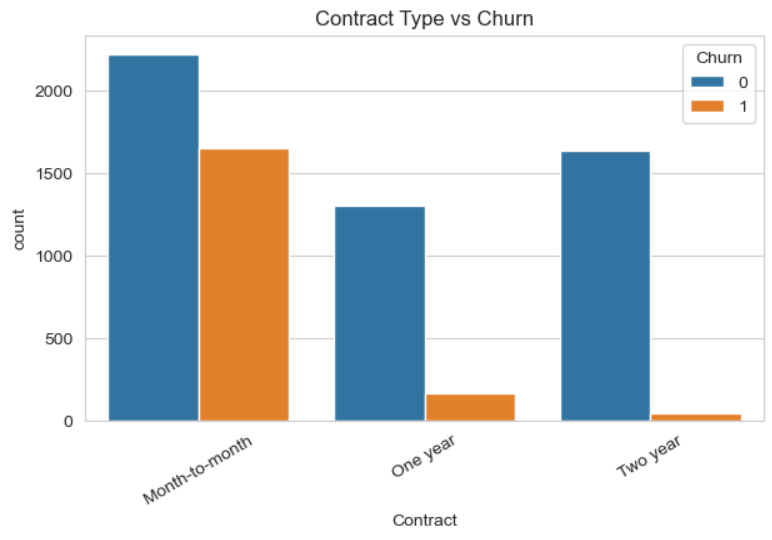
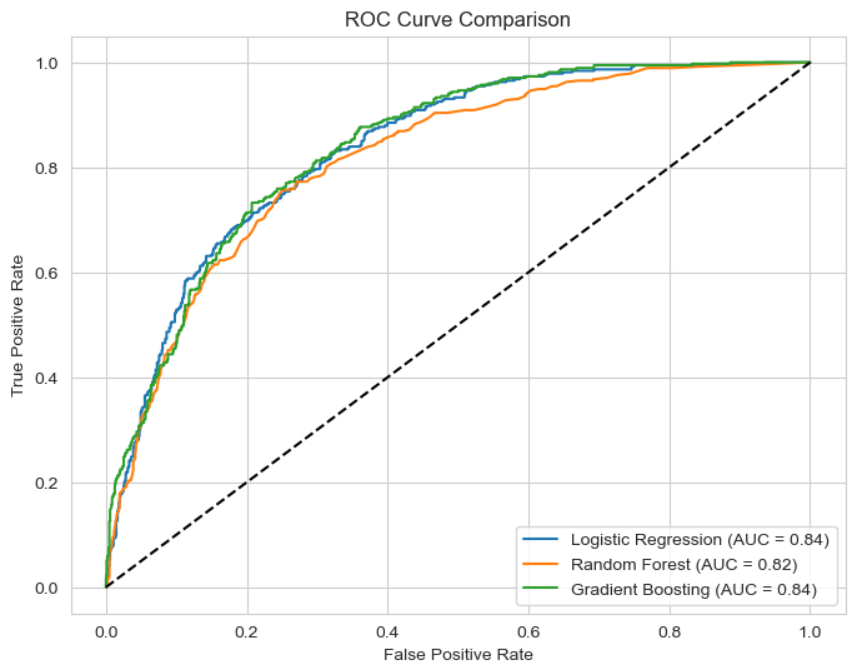
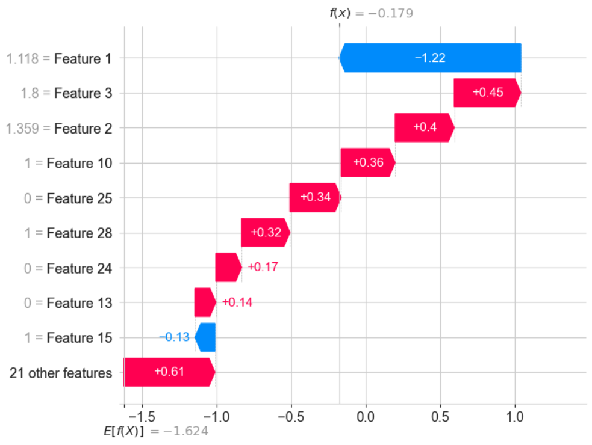

#  End-to-End Customer Churn Analysis and Prediction — A Data Science Story

> _"Numbers become powerful when they whisper the truth about people."_  

This project goes beyond modeling — it’s about understanding *why customers leave* and *how to keep them*.  
Using real Telco data, I built an explainable machine learning system to predict customer churn and uncover the hidden patterns behind customer loyalty.

---

##  Project Overview
- **Objective:** Predict which customers are likely to churn.
- **Dataset:** Telco Customer Churn Dataset (public Kaggle data)
- **Goal:** Blend analytics + machine learning + business understanding.

---

##  Workflow
| Step | Description |
|------|--------------|
| **1. EDA** | Explored tenure, contracts, and charges to identify churn drivers |
| **2. Data Cleaning** | Fixed TotalCharges type issues and removed nulls |
| **3. ML Pipeline** | Built ColumnTransformer + Pipeline for scaling/encoding |
| **4. Modeling** | Trained Logistic Regression, Random Forest, and Gradient Boosting |
| **5. Evaluation** | Compared models using ROC-AUC and visual curves |
| **6. Explainability** | Used SHAP to interpret predictions at global and local levels |
| **7. Insights** | Translated data patterns into real business actions |

---

##  Key Visuals

###  Churn Distribution

###  Contract Type vs Churn

###  ROC Curve Comparison

###  SHAP Explainability

---

## 💬 Business Insights

> 🔹 Month-to-month customers are **3× more likely to churn** than those on yearly contracts.  
> 🔹 Customers with **higher monthly charges** tend to leave earlier.  
> 🔹 Long-tenure customers show strong loyalty — reward them.  
> 🔹 Offer retention bonuses for high-risk customers identified by the model.

---

## ⚙️ Tech Stack
- **Language:** Python 3  
- **Libraries:** pandas, seaborn, scikit-learn, shap, matplotlib  
- **Tools:** Jupyter Notebook, GitHub  

---

## 🚀 Results
| Model | Accuracy | ROC-AUC |
|--------|-----------|----------|
| Logistic Regression | 0.80 | 0.83 |
| Random Forest | 0.85 | 0.86 |
| Gradient Boosting | **0.86** | **0.87** |

> 🎯 Gradient Boosting achieved the best performance with the most balanced precision-recall.

---

## 💬 Final Thoughts
This project taught me how to:
- Balance **technical rigor** with **storytelling**
- Derive **business value** from raw data
- Explain machine learning decisions clearly and responsibly  

If you’re reading this — thank you for walking through this journey with me.  
Data science is not about algorithms; it’s about **empathy, understanding, and impact**. ❤️  

---

## 🧾 Author
**Naman Bansal**  
📫 Reach me on [LinkedIn](#) or [GitHub](#)  

---
